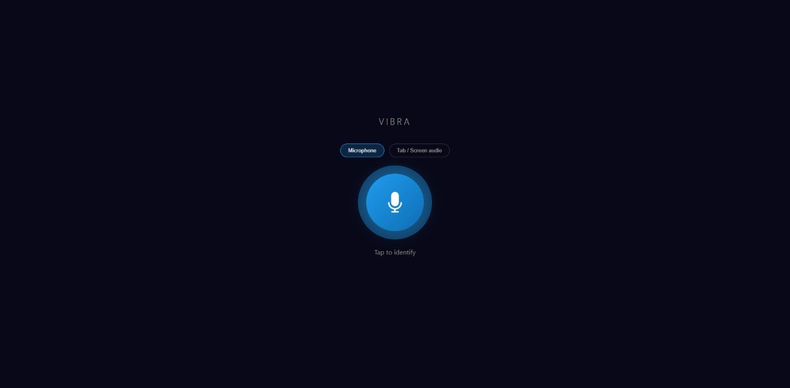

# vibra-web

A browser-based song recognition app — like Shazam, but self-hosted. Records a few seconds of audio from your microphone or browser tab, identifies the track via the Shazam API, and displays the title, artist, genre, cover art, and a direct link to the Shazam page.

Built on top of [vibra](https://github.com/BayernMuller/vibra), a C++ Shazam client.

---

## Demo



> Blue circular button → records 5 seconds → returns song details with a "Ver en Shazam" link.

---

## Requirements

- Python 3.8+
- [vibra](https://github.com/BayernMuller/vibra) built from source
- `ffmpeg` installed and available in PATH
- A machine with internet access (queries the Shazam API)

---

## Installation

```bash
# 1. Clone this repo
git clone https://github.com/jesustorres-code/vibra-web.git
cd vibra-web

# 2. Install Python dependencies
pip install -r requirements.txt

# 3. Build vibra (if not already built)
git clone https://github.com/BayernMuller/vibra.git
cd vibra
cmake -S . -B build
cmake --build build
cd ..
```

---

## Configuration

Edit `app.py` and update the `VIBRA` path to point to your local vibra binary:

```python
VIBRA = "/path/to/vibra/build/cli/vibra"
```

---

## Running

```bash
python app.py
```

The app starts on `http://localhost:7777`.

> **Note:** Browsers require HTTPS for microphone access. For local testing, use a tunnel:
> ```bash
> cloudflared tunnel --url http://localhost:7777
> ```

---

## Usage

1. Open the app in your browser.
2. Choose your audio source: **Microphone** or **Tab / Screen audio**.
3. Click the blue button — it records 5 seconds of audio.
4. The identified track appears with cover art and a link to Shazam.

---

## Project Structure

```
vibra-web/
├── app.py              # Flask backend — handles audio upload, conversion, recognition
├── templates/
│   └── index.html      # Single-page frontend
├── requirements.txt
└── README.md
```

---

## License

MIT
